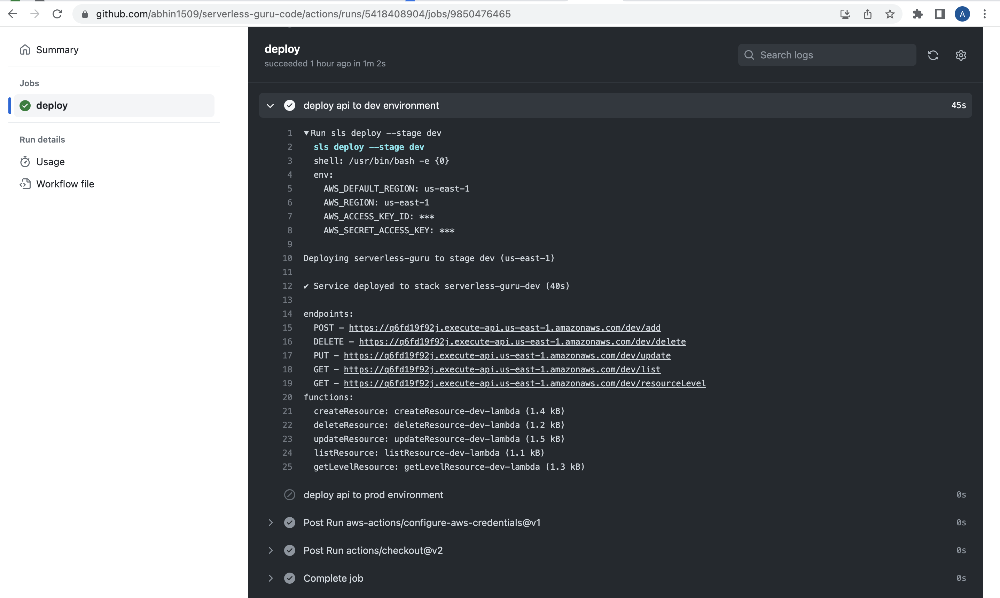
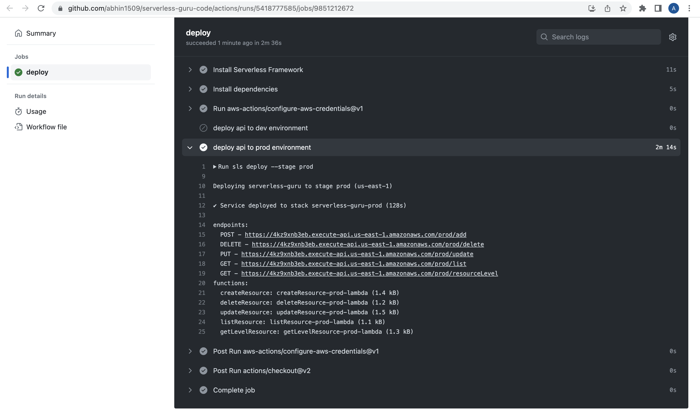
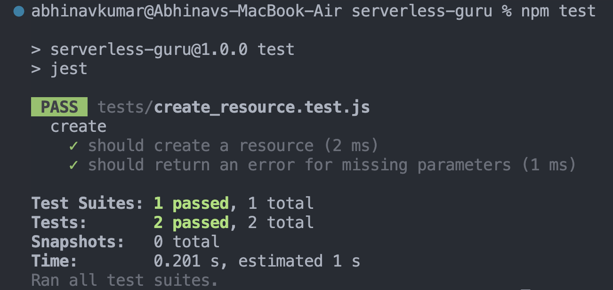

## Serverless Guru Code


This REST API provides CRUD operations for listing serverless tutorials. The tutorials can be blogs, videos, or documentations. Each tutorial includes the name of the topic, a link to the tutorial, and the level of difficulty (beginner, intermediate, or advanced).


### Instructions

1. Clone the repo

```
git clone https://github.com/abhin1509/serverless-guru-code.git
```

2. Go to the clonned directory

```
cd serverless-guru-code
```
3. Install Serverless Framework

```
npm install -g serverless
```

4. Install dependencies
```
npm install
```
5. Run test
```
npm test
```
6. Deploy the app (This app supports multistage deployment)
- Run below command to deploy app to `dev environment`
```
sls deploy --stage dev
```
- Run below command to deploy app to `prod environment`
```
sls deploy --stage prod
```

### Screenshots

- CI/CD deployment for `dev` enviroment.




- CI/CD deployment for `prod` environment.



- Test Case



### Tech Stack:
- Serverless Framework
- Github Actions
- API Gateway
- DynamoDB
- Postman
- Lambda
- Nodejs
- Jest
